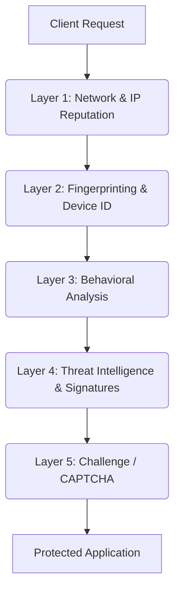

<h1 align="center">
  🛡️ AEGIS BOT SHIELD 🛡️
</h1>

<p align="center">
  <b>Advanced Bot Defense & Threat Mitigation SDK</b>
</p>

<p align="center">
  
  
  
  
  
</p>

## What is AEGIS?

AEGIS BOT SHIELD is an international-grade, high-performance bot defense system designed to protect web applications, APIs, and infrastructure from automated threats. It seamlessly identifies and blocks malicious bots while allowing legitimate human traffic to pass unharmed, ensuring optimal performance and robust security.

## Key Features

- 🤖 **Comprehensive Bot Detection**: Identifies automated traffic using behavior analysis and fingerprinting.
- ⚡ **High Performance**: Minimal latency impact on legitimate traffic.
- 🌍 **Global Threat Intelligence**: Leverages shared intelligence to block known malicious actors.
- 🧩 **Multi-Layer Defense**: A 5-layer architecture ensuring robust protection.
- 📊 **Real-time Analytics**: Interactive dashboard for monitoring and analyzing traffic.
- 🔌 **Easy Integration**: Drop-in support for Express, Flask, HTML, and more.

## Architecture

AEGIS employs a robust 5-layer defense architecture to ensure maximum protection:



## Quick Start

### 1. JS Tag (HTML Integration)

```html
<script src="https://cdn.aegisbotshield.com/sdk.js" data-aegis-key="YOUR_API_KEY"></script>
```

### 2. NPM Install (Node.js)

```bash
npm install @aegis/shield
```

### 3. Docker

```bash
docker pull aegisbotshield/node:latest
docker run -p 8080:8080 -e AEGIS_API_KEY=YOUR_API_KEY aegisbotshield/node:latest
```

## Integration Examples

### Express.js Middleware

```javascript
const express = require('express');
const { aegisMiddleware } = require('@aegis/shield');

const app = express();
app.use(aegisMiddleware({ apiKey: 'YOUR_API_KEY' }));

app.get('/', (req, res) => res.send('Protected by AEGIS!'));
app.listen(3000);
```

### Python Flask Middleware

```python
from flask import Flask
from aegis_shield import AegisMiddleware

app = Flask(__name__)
app.wsgi_app = AegisMiddleware(app.wsgi_app, api_key='YOUR_API_KEY')

@app.route('/')
def hello():
    return "Protected by AEGIS!"

if __name__ == '__main__':
    app.run()
```

## Defense Layers Explained

1. **Network Layer**: Checks IP reputation against global blocklists.
2. **Fingerprinting Layer**: Analyzes browser characteristics to identify anomalies.
3. **Behavioral Layer**: Monitors interaction patterns (mouse movements, typing speed).
4. **Threat Intelligence Layer**: Uses ML models to detect known attack signatures.
5. **Challenge Layer**: Issues silent or interactive challenges (e.g., CAPTCHA) for suspicious traffic.

## OWASP Coverage

AEGIS protects against all 21 OWASP Automated Threat (OAT) categories, including:

| Threat | Description | Coverage |
|---|---|---|
| OAT-001 | Credential Stuffing | ✅ |
| OAT-002 | Web Scraping | ✅ |
| OAT-008 | Scalping | ✅ |
| OAT-011 | Scraping | ✅ |

## Technology Stack

| Component | Technology |
|---|---|
| Dashboard | React, Tailwind CSS, Recharts |
| SDKs | TypeScript, Python |
| Backend | Node.js, Express, Redis, MongoDB |

## Dashboard Preview

The AEGIS admin dashboard provides real-time insights into your application's traffic, highlighting blocked threats and traffic patterns.

## API Reference

- `POST /api/v1/analyze`: Analyze a request for bot activity.
- `GET /api/v1/threats`: Retrieve a list of active threats.
- `POST /api/v1/config`: Update protection settings.

## Configuration

Customize AEGIS with options like `mode` (Monitor, Enforce, Strict), `rateLimit`, and `allowlist`.

## Contributing

See [CONTRIBUTING.md](CONTRIBUTING.md) for details on how to contribute to the project.

## Security

Please refer to our [SECURITY.md](SECURITY.md) for vulnerability reporting.

## License

MIT License. See [LICENSE](LICENSE) for details.

## Author

dipro20debnath
