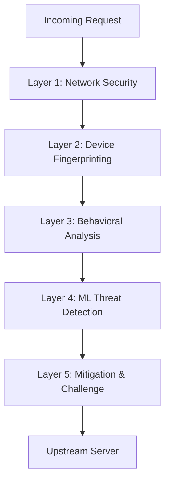

# AEGIS Architecture

AEGIS BOT SHIELD utilizes a high-performance, distributed architecture.

## 5 Defense Layers

### Layer 1: Network Security
Filters traffic based on IP reputation, Geo-IP, and known bad ASNs.

### Layer 2: Device Fingerprinting
Collects non-PII device characteristics to identify spoofed environments and headless browsers.

### Layer 3: Behavioral Analysis
Analyzes request rates, navigation patterns, and interaction metrics.

### Layer 4: ML Threat Detection
Applies machine learning models trained on millions of request patterns to identify novel bots.

### Layer 5: Mitigation & Challenge
Issues silent challenges (Proof of Work) or interactive challenges based on the risk score.
