# Screenshots of the study website

Attachment to the research protocol (§10). Taken from the actual study software (`study/`) with
`node docs/thesis/irb/screenshots/capture.mjs`; re-run it after the information sheets are filled in so
the pages show the final text. Codes, names and delivery details visible here are invented test values.

## 1. Landing

Start page: purpose in one sentence, language choice (Bangla / English).

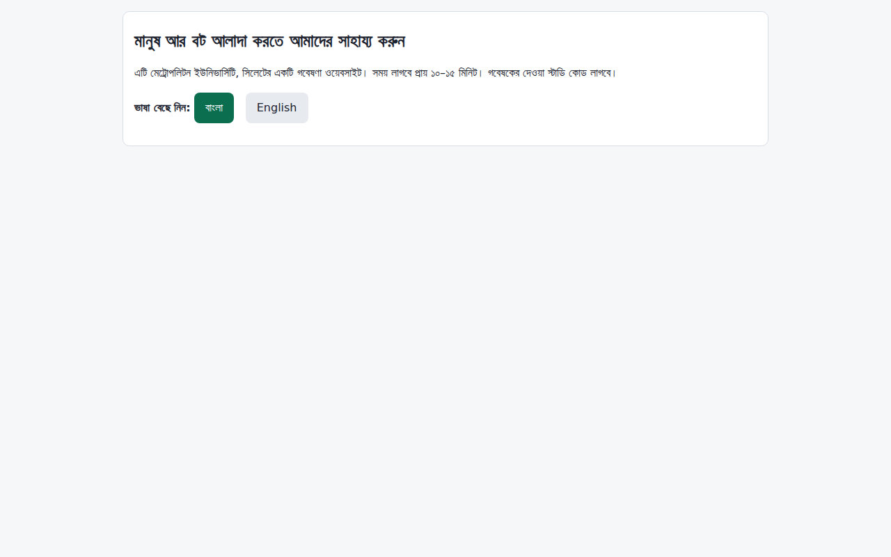

## 2. Consent (Bangla)

Information sheet in Bangla (shown word for word from `consent_bn.md`), the four required consent boxes, the optional raw-timing box and the study code field. The yellow DRAFT notice appears until the placeholders are filled in.

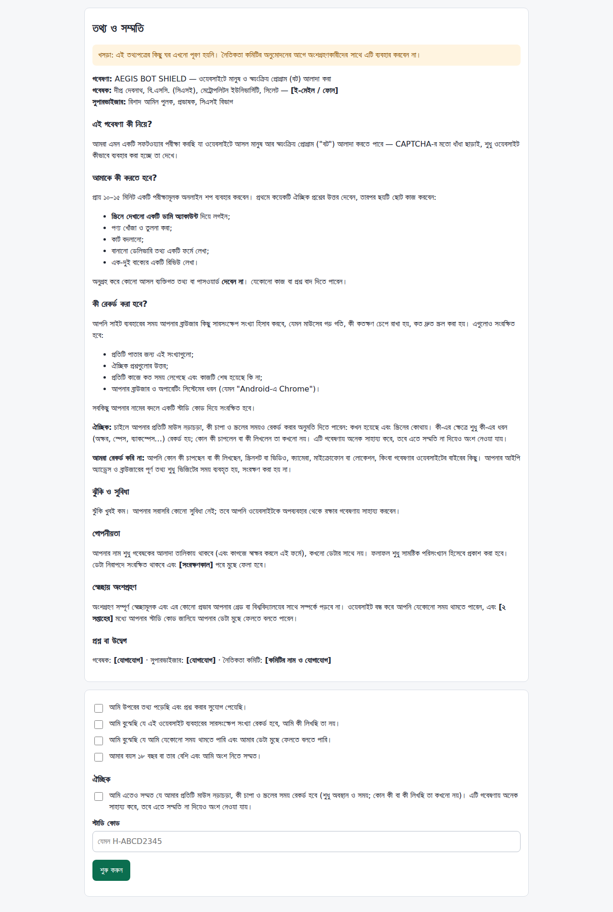

## 3. Consent (English)

The same page in English (`consent_en.md`).

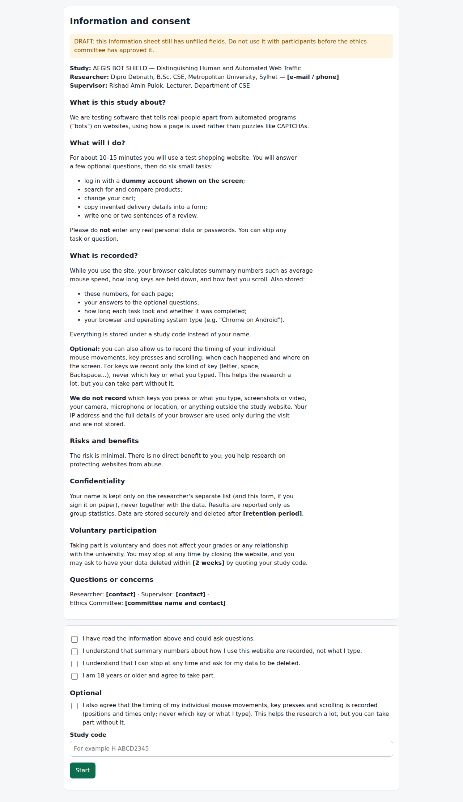

## 4. Survey before

Survey before the tasks: fixed options, every question optional ("Prefer not to say").

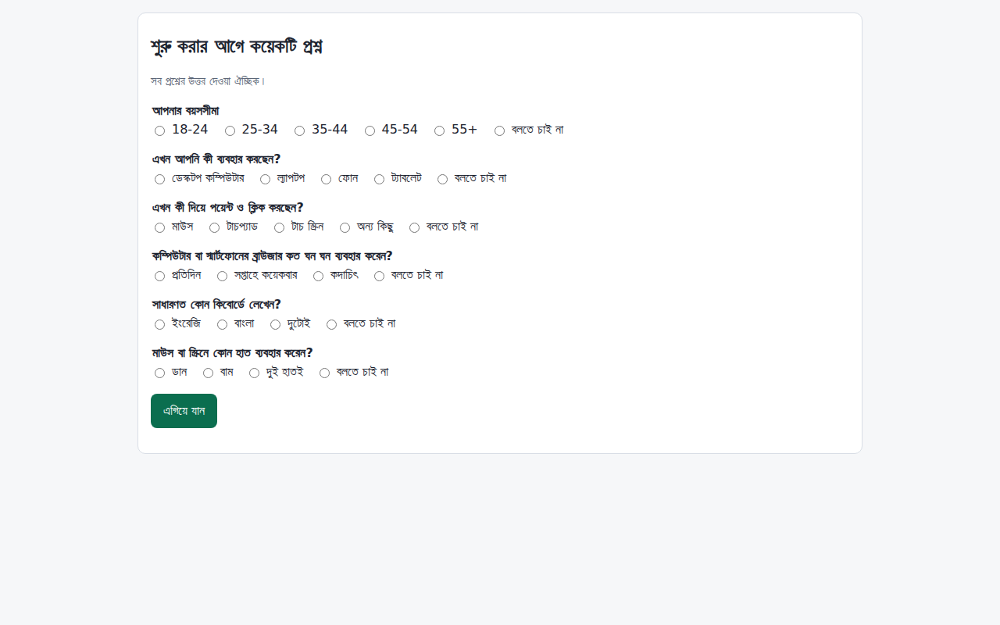

## 5. Task 1

Task 1: the dark bar at the top shows the task and the dummy username and password; every task has a "Skip this task" button.

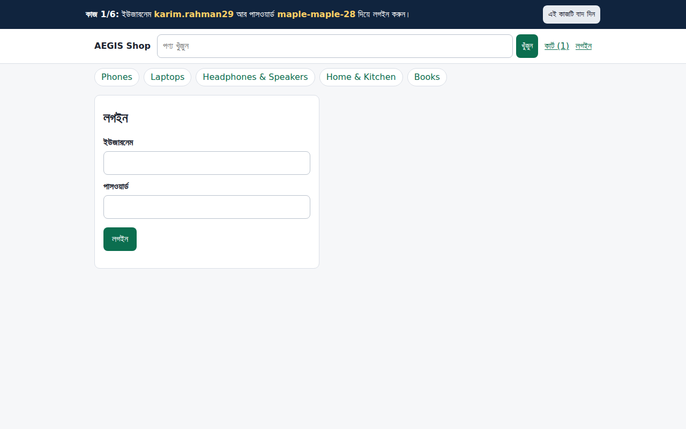

## 6. Task 2

Task 2: search results.

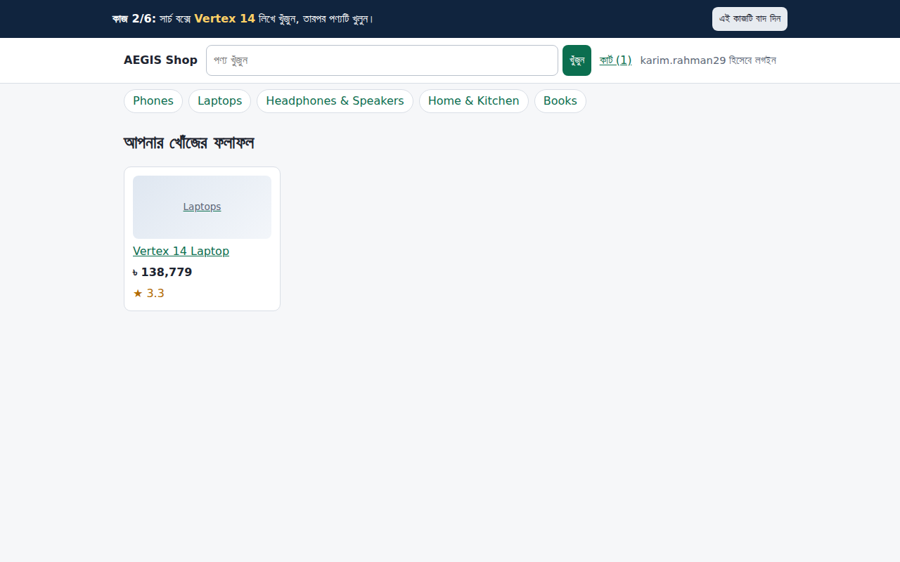

## 7. Task 3

Task 3: a category list, where the participant compares prices and ratings.

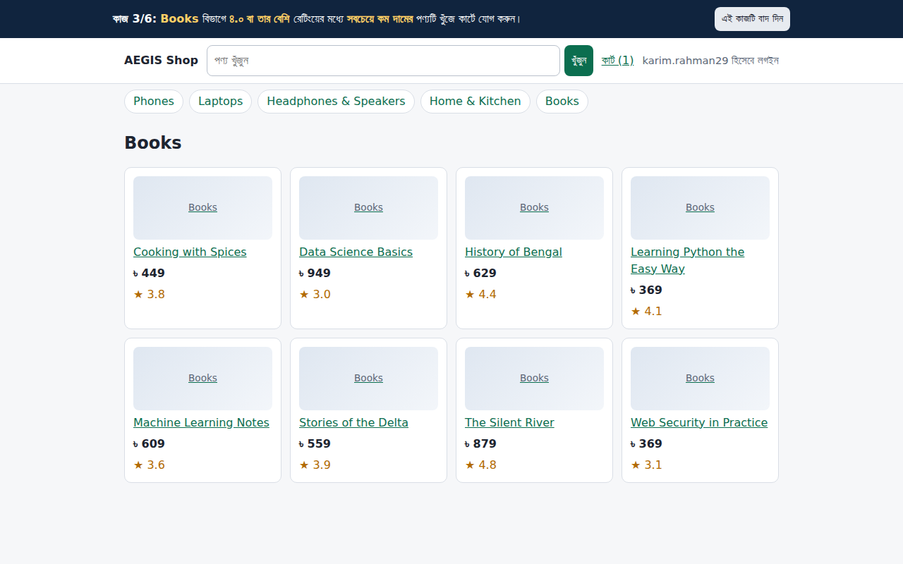

## 8. Task 4

Task 4: the cart, with quantity and remove buttons.

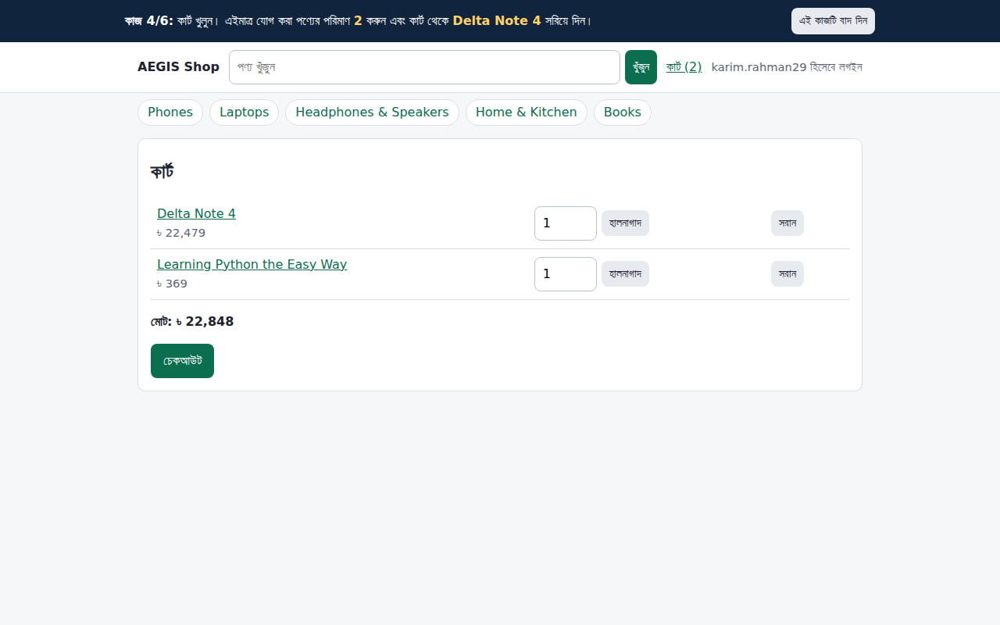

## 9. Task 5

Task 5: checkout form with the invented delivery details to copy from the task bar; no payment fields.

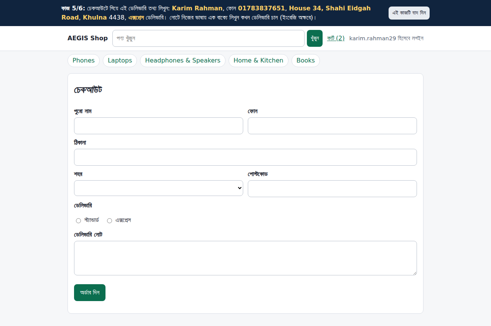

## 10. Task 6

Task 6: writing a short review and choosing stars.

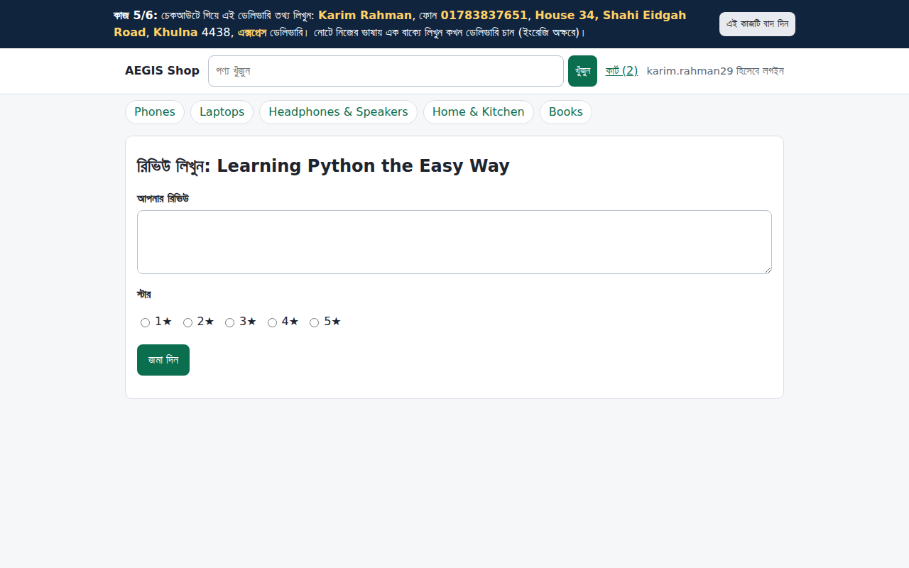

## 11. Survey after

Closing survey (autofill, automation tools, assistive tools, interruptions, difficulty), all optional.

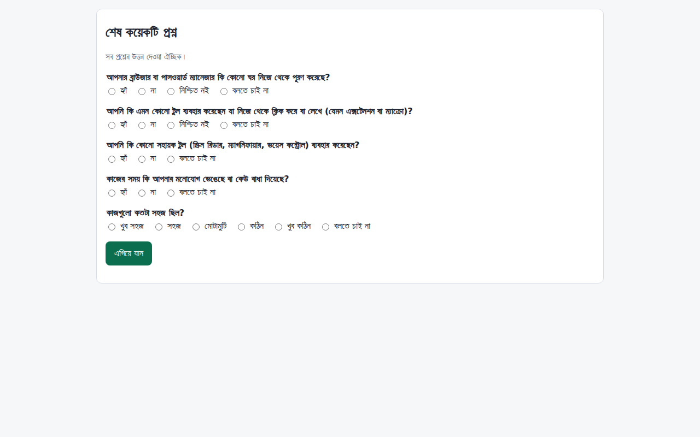

## 12. Done

Thank-you page repeating the study code, which is needed to withdraw.

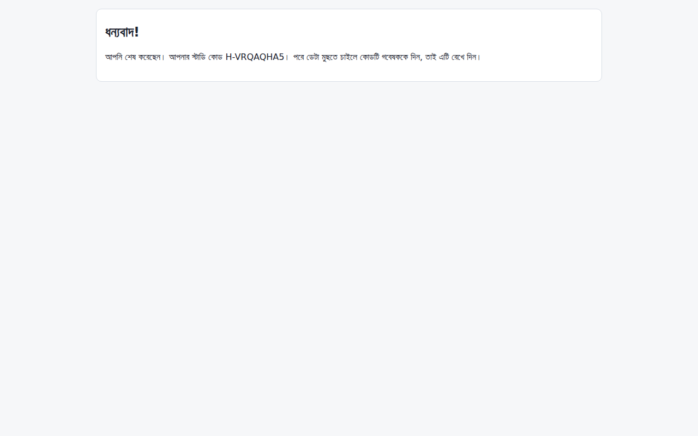

## 13. Phone: consent

Consent page on a phone.

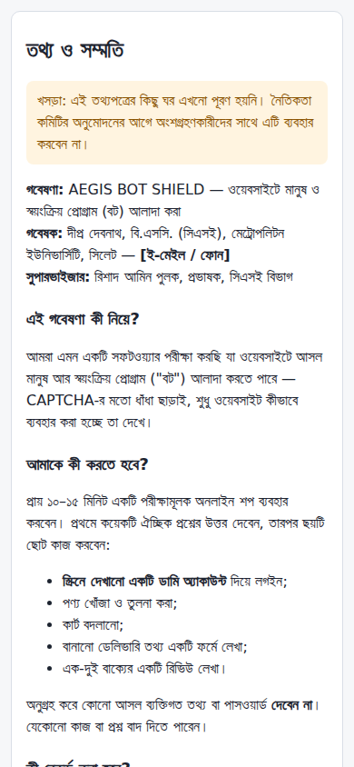

## 14. Phone: task

A task page on a phone.

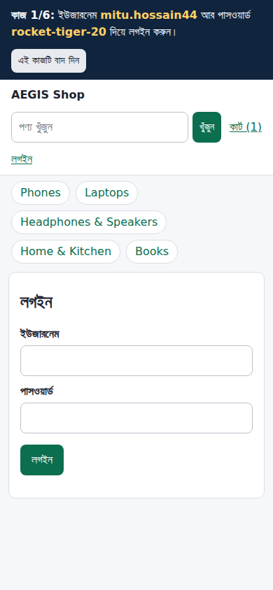
